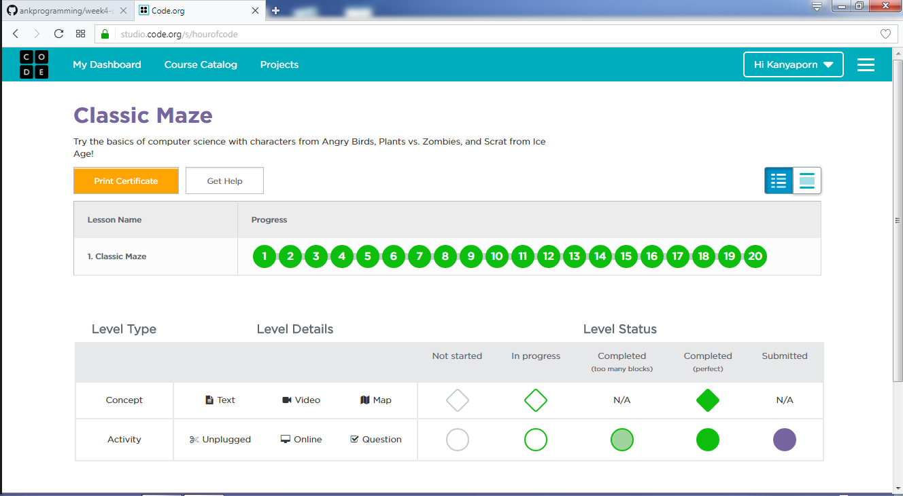
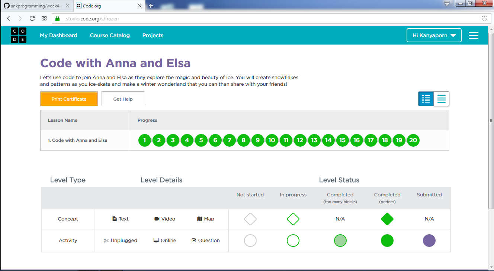
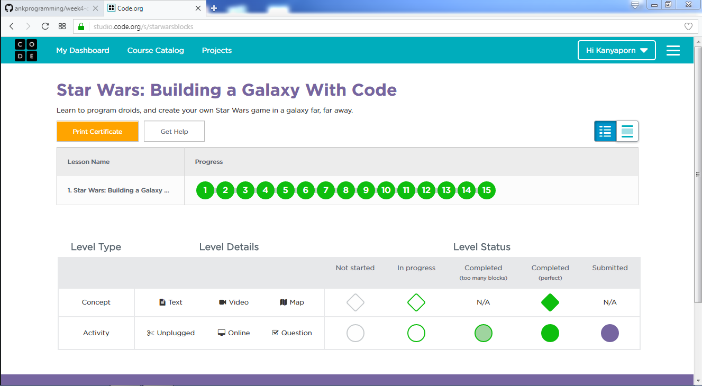
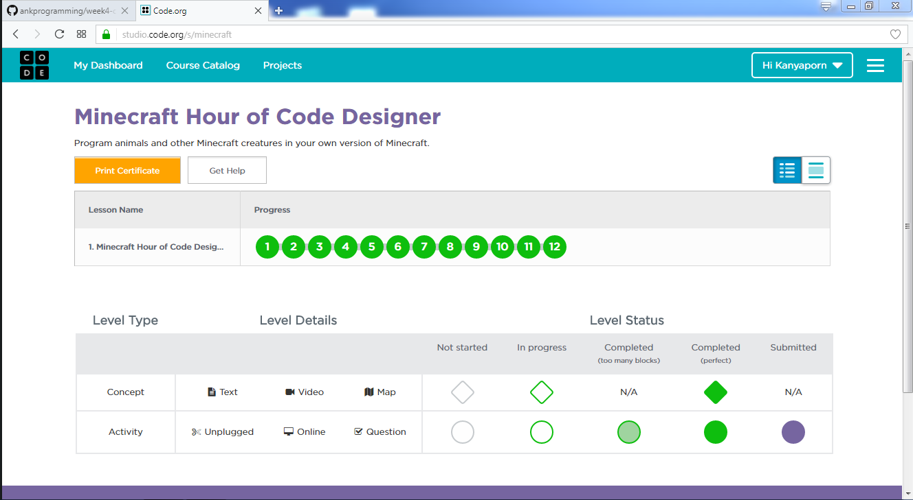

# tp_prog_week3
งานครั้งที่ 4 วิชาการเขียนโปรแกรมคอมพิวเตอร์ ปวส1

## วิธีการส่งงาน

1.  บันทึกหน้า dashboard ของแต่ละกิจกรรม
2.  **ตั้งชื่อตามนี้**
    -  Angry Bird เป็น lab1.png
    -  Frozen เป็น lab2.png
    -  Star wars เป็น lab3.png
    -  Minecraft เป็น lab4.png
3.  อัพทั้ง 4 รูปไว้ใน folder img (เมื่อสำเร็จไฟล์จะมีภาพปรากฎ)
4.  เขียนสรุปสิ่งที่ได้ด้วย

------------------------------------------

## กิจกรรมทดลอง Angry bird

### ภาพยืนยันความสมบูรณ์ (3 points)

### สรุปสิ่งที่ได้เรียนรู้จากกิจกรรม (2 points)

$$$$1

ได้ฝึกใช้คำสั่งวน ลูป ในการเดินวนให้สำเร็จภารกิจ มีการฝึกใช้คำสั่งเงื่อนไข 

1$$$$

-------------------------------------------

## กิจกรรมทดลอง Frozen

### ภาพยืนยันความสมบูรณ์ (3 points)

### สรุปสิ่งที่ได้เรียนรู้จากกิจกรรม (2 points)

$$$$2

ได้ฝึกใช้คำสั่งวน ลูป ในการเดินวนให้สำเร็จภารกิจ ได้รู้ว่าการใช้คำสั่งลูปสามารถใช้คำสั่งลูปซ้อนลูปได้ ใส่คำสั่งในลูปหลายๆคำสั่งได้ มีการใช้คำสั่งสร้างรูปวงกลม รูปสี่เหลี่ยมคางหมู และสร้างเส้น

2$$$$

------------------------------------------

## กิจกรรมทดลอง Star wars

### ภาพยืนยันความสมบูรณ์ (3 points)

### สรุปสิ่งที่ได้เรียนรู้จากกิจกรรม (2 points)

$$$$3

มีการใช้คำสั่ง random เปลี่ยนไปแต่ละครั้งที่เล่น มีการใส่คำสั่งเสียง การใช้คำสั่งเพิ่มคะแนน ลบคะแนน มีการกำหนดความเร็ว

3$$$$

-------------------------------------------

## กิจกรรมทดลอง Minecraft

### ภาพยืนยันความสมบูรณ์ (3 points)

### สรุปสิ่งที่ได้เรียนรู้จากกิจกรรม (2 points)

$$$$4

มีการใช้คำสั่งวนลูป มีการใส่คำสั่งต่างๆกำหนดตัวละครแต่ละตัวให้ปฏิบัติจนสำเร็จภารกิจแต่ละด่าน

4$$$$

-------------------------------------------

## สรุปคะแนน

| Topic          | Score           |
| :------------- | :-------------: |
| Angry Bird 1   |                 |
| Angry Bird 2   |                 |
| Frozen 1       |                 |
| Frozen 2       |                 |
| Star wars 1    |                 |
| Star wars 2    |                 |
| Minecraft 1    |                 |
| Minecraft 2    |                 |

**รวม :** 0 คะแนน
